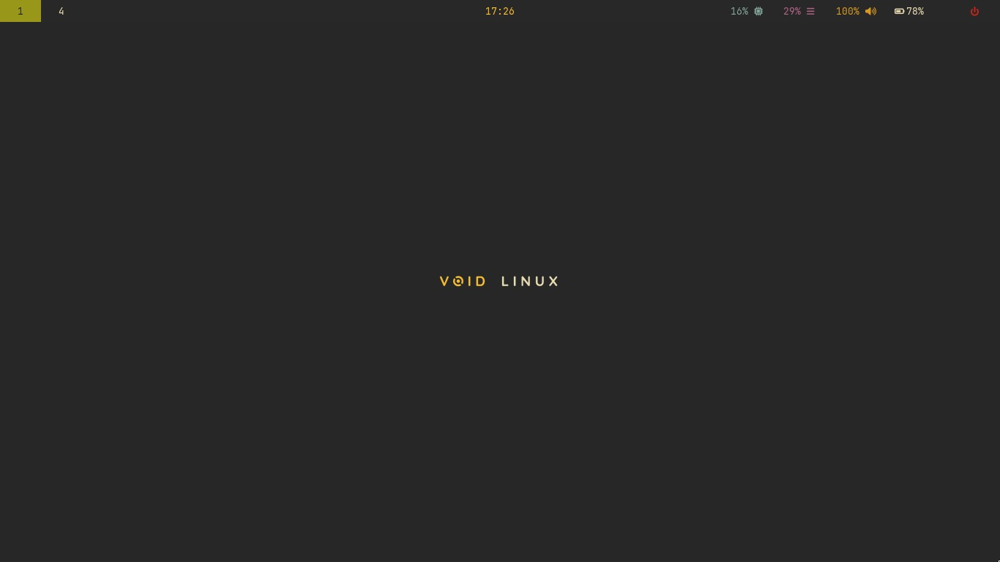
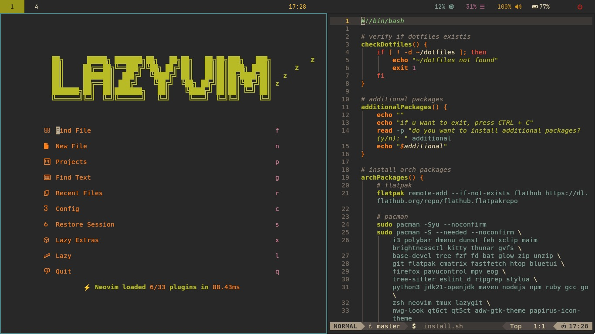
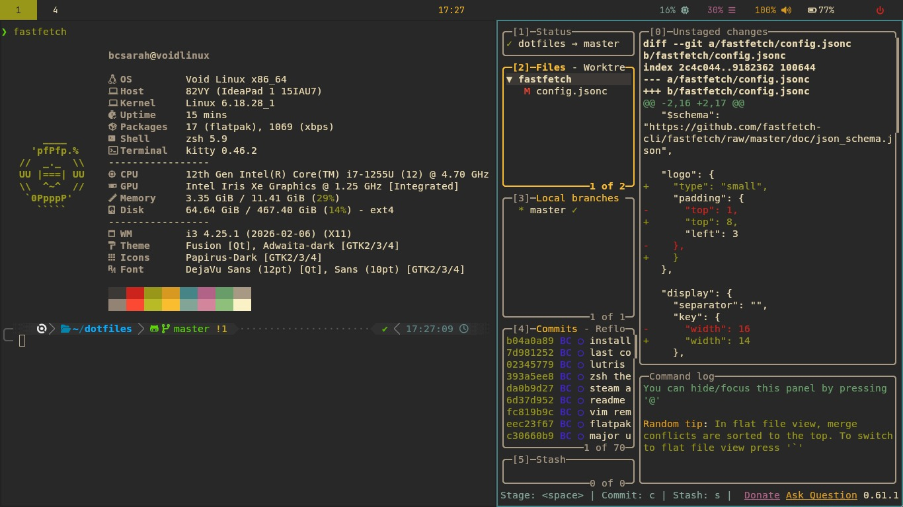

# 🐧 Dotfiles
This repository contains my **dotfiles** since February 2026, focused on a modern, minimal, and consistent environment using the **Gruvbox theme** across the entire system

---
## 🎨 Theme
Uses **Gruvbox**, with an aesthetic that is:
- Easy on the eyes
- Focused on visual comfort
- Consistent across all tools

---
## 📸 Preview




---
## 🧰 Tools
- **WM:** i3wm
- **Bar:** polybar
- **Launcher:** dmenu
- **Terminal:** kitty
- **Shell:** zsh
- **Editor:** nvim
- **Git UI:** lazygit
- **Fetch:** fastfetch

---
## 🛠️ Installation
Just run install.sh and see what you need to do. **This script is under development and testing.**
**THIS SCRIPT DOESNT DO A BACKUP! Make sure to backup everything before using the script**

### ⚙️ What the scripts do
1. Updates the system
2. Install core packages (i3, nvim, lazygit etc)
3. Install additional packages (if you want)
4. Install configures flathub
5. Creates symbolic links from ~/dotfiles
6. Changes your default shell to `zsh`
- (personally, i recommend you view the entire install.sh to make sure what this script can do)

### 🚀 Installation steps
The scripts expect the repository to be exactly at `~/dotfiles`

```bash
git clone https://github.com/bcsarah/dotfiles.git ~/dotfiles
cd ~/dotfiles
chmod +x install.sh
bash install.sh
```

- After the installation is finished, i3wm, polybar, kitty, shell and other configurations will be active after you log out and back in the right environment (i3)

### ⚠️ Notes
- **replace existing configs** - The scripts replace existing configuration folders (i3, polybar, kitty, nvim, lazygit, tmux). If you have configurations you want to keep, back them up first
- **YAY** - The Arch script installs the yay AUR helper
- **SNAP** - The Debian script installs snap and uses it for lazygit and nvim
- **All scripts run with sudo** - you will be asked for your password and others during the installation

---
## ❤️ Made with love
This dotfiles was made with a lot of love and care for those who want a setup similar to mine (or mine btw)
> Better use linux btw 🐧
